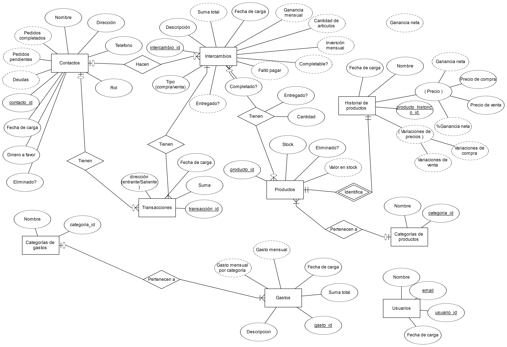
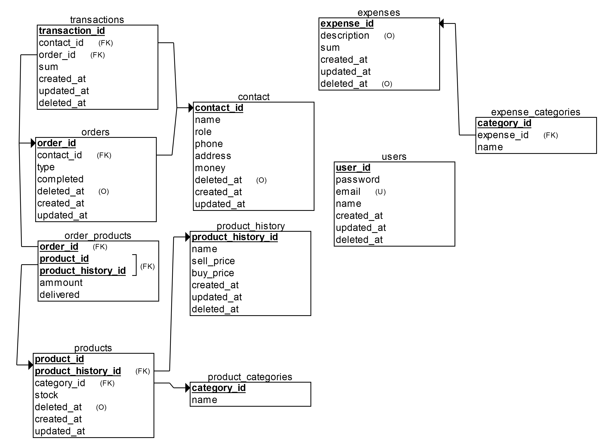

FORMAT: 1A

# PHPStockREST

Api rest backend de chakra stock

## Base de datos
- El script para crear las tablas con sus relaciones en **mysql** está en [tables.sql](tables.sql)
- Para tener una base de datos con ya un par de datos guardados, podés importar [chakra_stock.sql](chakra_stock.sql)

### Diagrama Entidad-Relación

- "Fecha de carga" representa los 3 timestamps de las tablas ("created_at","updated_at","deleted_at"), que no los puse por separado porque ocupaban mucho espacio.

## Diagrama de tablas

## Endpoints

- [Usuarios](docs/api/users.md)
- [Contactos](docs/api/contacts.md)
- [Productos](docs/api/products.md)
- [Pedidos](docs/api/orders.md)
- [Transacciones](docs/api/transactions.md)
- [Gastos](docs/api/expenses.md)